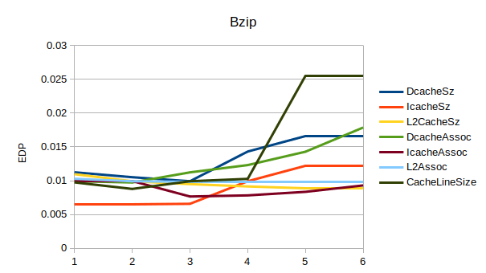
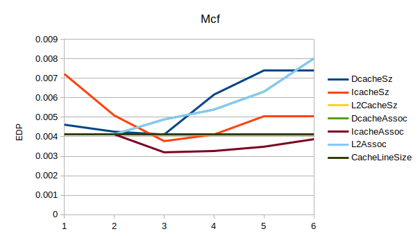
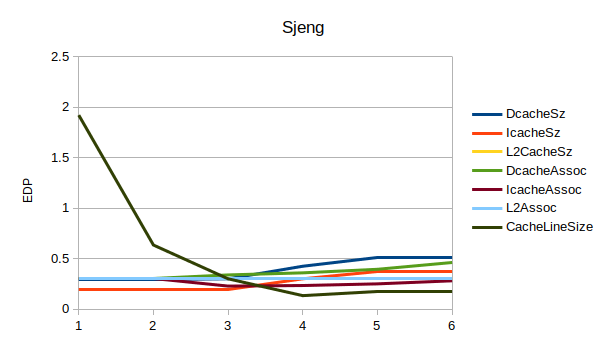
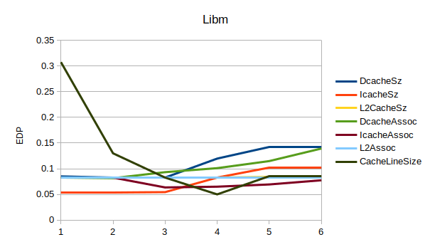
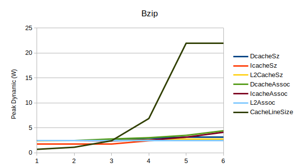
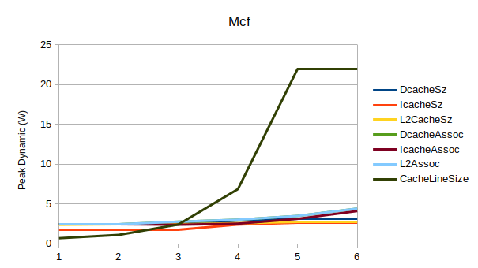
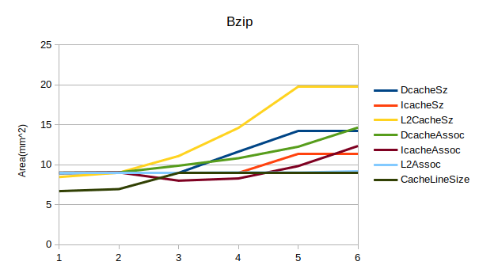
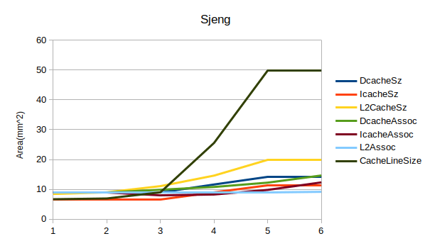

# Lab-3  

Computer Architecture Lab 3  
This report was written by Ioannis Diamantaras (9387) and Dimosthenis Mpounarelis (9431).  

## Answer 1:
_Leakage_ and _Dynamic Power Consumption_ are both contributing factors to a CPU's total energy/power consumption. They, along with any _Short-Circuit Power Consumption_ define the overall energy needs of a processor. Nowadays, _Short-Circuit Power Consumption_ is ignored as it is relatively small and can be considered as part of the dynamic power consumption.  
  
Dynamic Power Consumption, specifically is the power required by the capacitors of the logic gates within the CPU. It is generally calculated as **_Pdyn = a*Σ(Ci*Vdd^2*f)_** where _Ci_ is the capacity of the individual capacitors that changed state, **_f_** is the frequency and and **_Vdd_** is the supply voltage and **_a_** is a switching factor (it represents the percentage of gates that actually switch within a clock cycle). A more accurate formula would be **_Pdyn = a*f*(ci*li+hi*ki*Co)*Vdd^2_**  
  
Leakage power is the static "leakage" of power through components normally percieved as insulating, such as a diode or any gradual losses from components such as charged capacitors. This type of power consumption is usually separated into two different categories: Subthreshold leakage and gate leakage. The first of the two refers to currents that continue to exist in components that are in their cutoff regions while the second refers to currents passing through the gate's oxides. Its value is **_Ple = hi*ki*Vdd*(Isub+Ig)_**  
  
Dynamic power consumption is going to increase in a "per program" basis and should scale more with the amount of the CPU operations than the actual time it takes for them to happen, of course, longer programs usually gave more instructions/operations so it would be expected that program execution time also indirectly affects this metric. Leakage is a more static power draining component which should only be related to CPU usage duration rather than instruction count.

_(Sources: https://en.wikipedia.org/wiki/Processor_power_dissipation, https://en.wikipedia.org/wiki/Leakage_(electronics), https://www.sciencedirect.com/topics/computer-science/dynamic-power-consumption, Three-Dimensional Integrated Circuit Design by Vasilis F. Pavlidis, Ioannis Savidis, Eby G. Friedman, https://hal.inria.fr/hal-02166019/document)_

When dealing with the problem of optimizing power usage for a 40Watt battery compared to a 4Watt battery we should consider the following methods:  
- Firstly, we could reduce the leakages to such a degree that they are incocequncial. Supposing that our 4Watt CPU has 9 times as much leakage as its dynamic power consuption this could indeed make the 40Watt CPU better (of course this is a very unrealistic scenario and we have a comment about it after the other methods have been explained)  
- Second, we could improve the 40Watt's CPU CPI while ensuring that leakages are on a similar scale on both processors. This way the what processor would have to operate for a lot fewer clock cycles thus draining a lot less "Dynamic Power". (This approach is slightly more realistic as we saw in the last lab that CPI can be reduced greatly depending on the architecture)  
- Lastly, we could improve overall speed of execution for the program while minimizing the leakages. In this case it doesn't necessarily have to specfically a CPI reduction as it could also be a clock speed increase or other technique. As long as the total required power remains at 40Watt the speed improvement may reduce the overall power usage of the CPU.  
  
Of course, we realize, the perfect answer lies somewhere inbetween the previous methods with a minimization of leakages and a program execution speedup. The methods we proposed, are somewhat unrealistic on their own but work multiplicatively thus we consider that result possible to achieve (despite it being difficult to do so).  

For the final question we run the two simulations for Xeon and ARM A9. We found that Xeon consumes 72.9199W of dynamic power while A9 consumes 2.96053W, Their leakages are 36.8319W and 0.108687 accordingly. Now, supposing that our program runs for x seconds on Xeon and 40\*x seconds on A9, if both CPUs are "up and running" until both of them finish then we have:  
Xeon -> 72.9199\*x + 36.8318\*40\*x = 1546.1959\*x  
A9 -> (2.96053+0.108687)\*40\*x = 122.76868\*x
It is quite apparent that since the _Leakage power_ of Xeon is consistently larger than the overall power drain of A9, we could never achieve a more efficient usage of the Xeon processor if that CPU has to operate for the same amount of time as A9.

## Answer 2:
We run the McPAT for the previous simulations. For each of the simulations , only one variable was being changed at a time, while the rest of them were keeping their default value. We did this so that we could clearly see the impact of each variable in EDP , in the Area and in the Peak Dynamic.  
The EDP graphs follow:  

  
In an effort to make the graphs more compact , we have put every variable of each benchmark in the same graph. The DCacheSize and ICacheSize range from 2^3 to 2^7, the L2CacheSize ranges from 2^8 to 2^12 , the Associativities from 2^0 to 2^5 and the Cache Line Size from 2^4 to 2^8. We can notice the associativities have one value more than the other variables, so we duplicated the last value of the rest of the vaiables to fit in the same graph.
If we assume that the variables are lighlty dependent on each other, then we can safely deduce which values ,those characteristics should take in order to get the best EDP.  
Here are the results:  
|       | DCacheSize | ICacheSize | L2CacheSize | DCache Assoc | ICache Assoc | L2Cache Assoc | CacheLineSize | EDP       |
|-------|------------|------------|-------------|--------------|--------------|---------------|---------------|-----------|
| Bzip  | 32kB       | 8kB        | 4MB         | 2            | 4            | 32            | 32            | 0.0210738 |
| Mcf   | 32kB       | 32kB       | 2MB         | 1            | 4            | 2             | 64            | placeholder |
| Sjeng | 8kB        | 8kB        | 256kB       | 1            | 4            | 2             | 128           | 0.291276  |
| Libm  | 32kB       | 8kB        | 256kB       | 2            | 4            | 8             | 128           | 0.0584338 |
  
In order to prove that these values are the best for the lowest EDP we run some additional simulations with the gem5 program and then we used the McPAT to get the needed information. We came to this conlusion, that the processor characteristics are not so lightly dependent as we initially thought and the aforementioned best characteristics ,while lowering the EDP to a great extent, are not really the best.  
The Peak Dynamic and Area graphs follow.  

  
We noticed that the Area graphs are the same for every benchmark, which is logical ,since the hardware should not be affected by the software.

The output of the McPAT program could have a significant error if the provided CPU model was incomplete or high lever. Another source of error could that the "ARM" template assumes that certain stuctures exist in the CPU in consideration, while they do not. In the first case, where the cpu model is lacking , the McPAT models only a subset of the total area and the power of a component. This subset consists of caches, CAMs and SRAM array based structures and lacks control units. 
As for the question if using two programs examining different aspects of the same system could result in an error, we think that this could be the case , since each program could use different techniques and models to describe the same system , resulting in an incoherent output.  
  
_(Sources: https://www.samxi.org/papers/xi_hpca2015.pdf , https://www.researchgate.net/publication/228674742_McPAT_10_An_Integrated_Power_Area_and_Timing_Modeling_Framework_for_Multicore_Architecture, https://ieeexplore.ieee.org/document/7056064)_

  
## Comments:  
We found out that for each value of the variable "Cache line size" , we got the same Peak Dynamic value in every benchmark.
